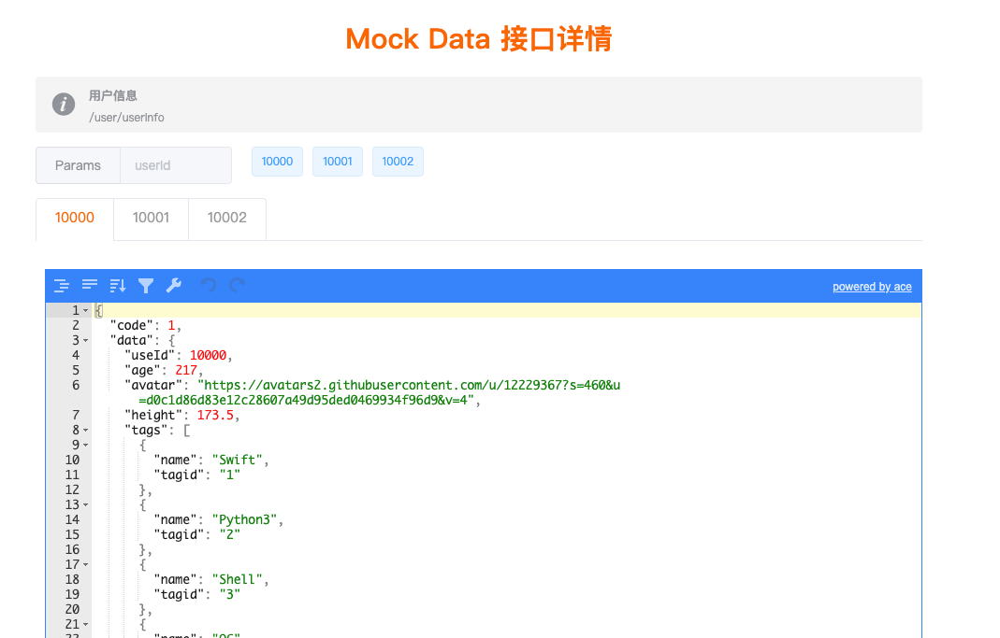

<!--
 * @Date: 2020-07-03 16:50:34
 * @Author: ashen23
 * @LastEditors: ashen_23
 * @LastEditTime: 2020-07-03 17:27:11
 * @FilePath: /faker/README.md
--> 

Faker 用于一键搭建本地 mock data 服务，基于python3 + Flask。


## 特性
- [x] GET/POST 请求
- [x] 后台管理 [homepage](http://127.0.0.1:5000/)
- [x] 自定义参数类型(Params,form等)
- [x] 实时修改返回内容，即时生效
- [x] 一键搭建本地服务
- [ ] 快速批量导入接口




## 依赖

- [Python3](https://www.python.org/downloads)

## 安装与使用

### clone 项目

```Shell
git clone git@github.com:515783034/Faker.git

# 下载依赖
cd faker
python3 -m venv venv
source venv/bin/activate
pip3 install -r requirements.txt
```

### 增加执行权限

```Shell
# 切换到当前路径
cd currentPath

# 增加执行权限
chmod 777 start.sh
chmod 777 stop.sh
```

### 运行

```Shell
# 运行
./start.sh

# 以调试模式运行
cd faker
source venv/bin/activate
python3 main.py

# 查看后台
http://127.0.0.1:5000/ 或 http://0.0.0.0:5000/
```

### 项目配置

项目配置文件的路径为 faker/config/config.ini，可自由配置

```
apiFile: 设置运行的project
```

## 相关工具

- tools/makeProject.py: 创建一个新的项目
    
    ```
    python3 tools/makeProject.py newProject
    ```
- toos/deleteProject.py: 移除当前已存在项目

    ```
    python3 tools/deleteProject.py someProject
    ```


## FAQ

### 手机如何访问 flask 本地服务器?

```Shell
# 手机和电脑在同一局域网下

# flask 的 host 需要设置为0:0:0:0, port(端口)随意

# 手机端通过"http://电脑ip:端口/***"访问API即可
```

### 这个项目的起因是什么？

客户端开发测试过程中太过依赖于服务端，为了解决这种依赖所产生的沟通成本，所以有了搭建本地服务的思考。
主要解决的痛点：
- 服务端同事给了接口文档后，还需要很长的时间才能调用接口
- 测试 UI 的兼容情况(数据为空，数据量过长等)或者业务逻辑，需要依赖服务端同事调整接口返回内容

举个栗子：
李雷(客户端)和韩梅梅(服务端)两人开发【购买线上英语课程】的功能，两个商量好接口及返回内容后，李雷此时将接口录入本地服务器后，开始搭建界面，无须 mock 代码，直接按照正常逻辑进行开发。
李雷想测试课程列表页返回为空时，UI 显示是否正常，修改本地 json 文件再 ctrl+s 后刷新界面，即可验证；
李雷想测试课程标题过长后有没有 UI 兼容问题，修改 json 中的 title，刷新界面即可；
李雷想测试接口报错时 UI 显示是否异常，将 json 中的错误码修改为-100，再次请求即可；

开发完毕后，仅需修改 baseUrl 即可在生产服务器上验证。